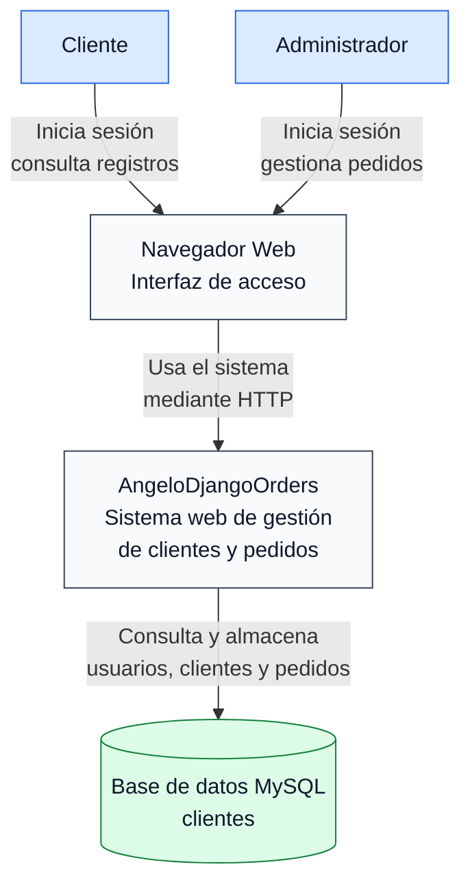
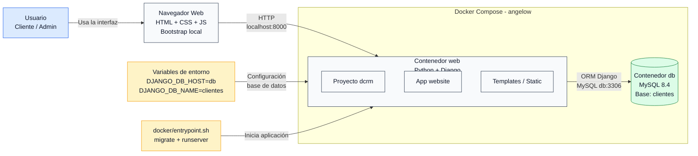
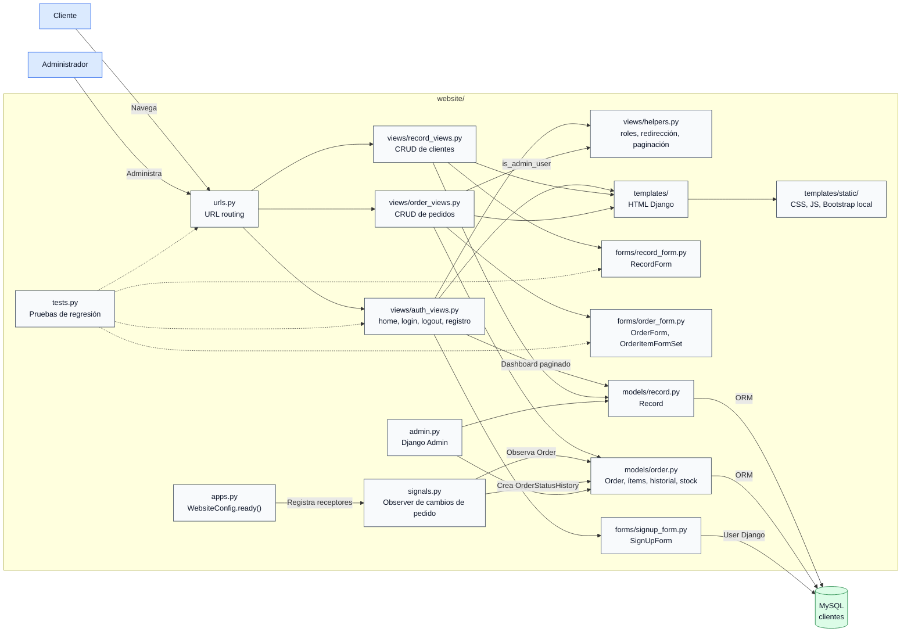
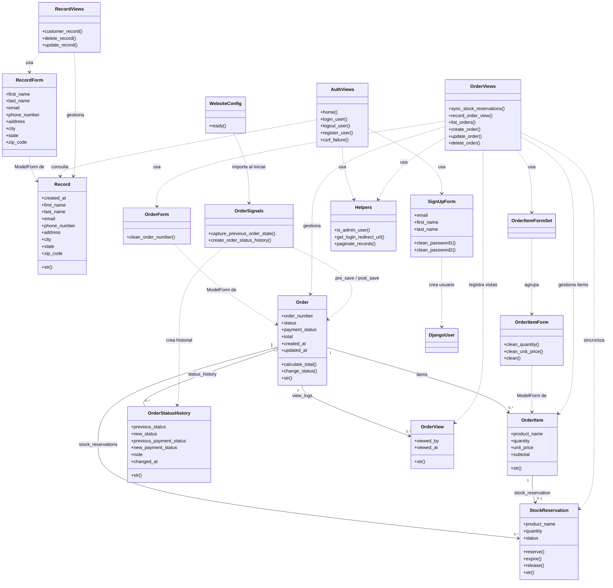
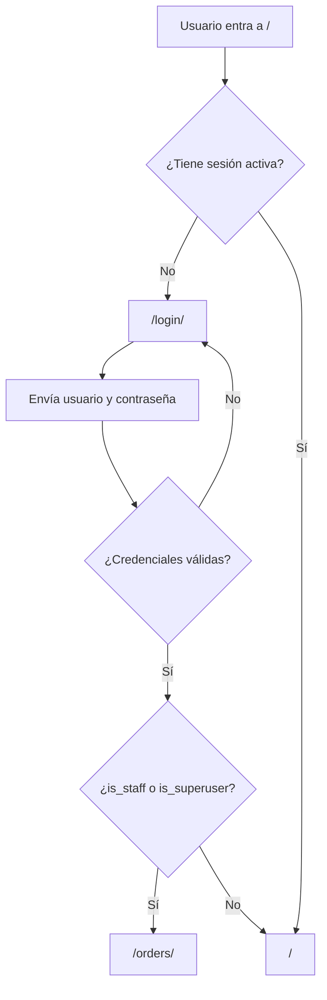
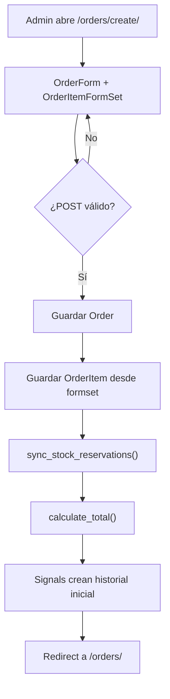
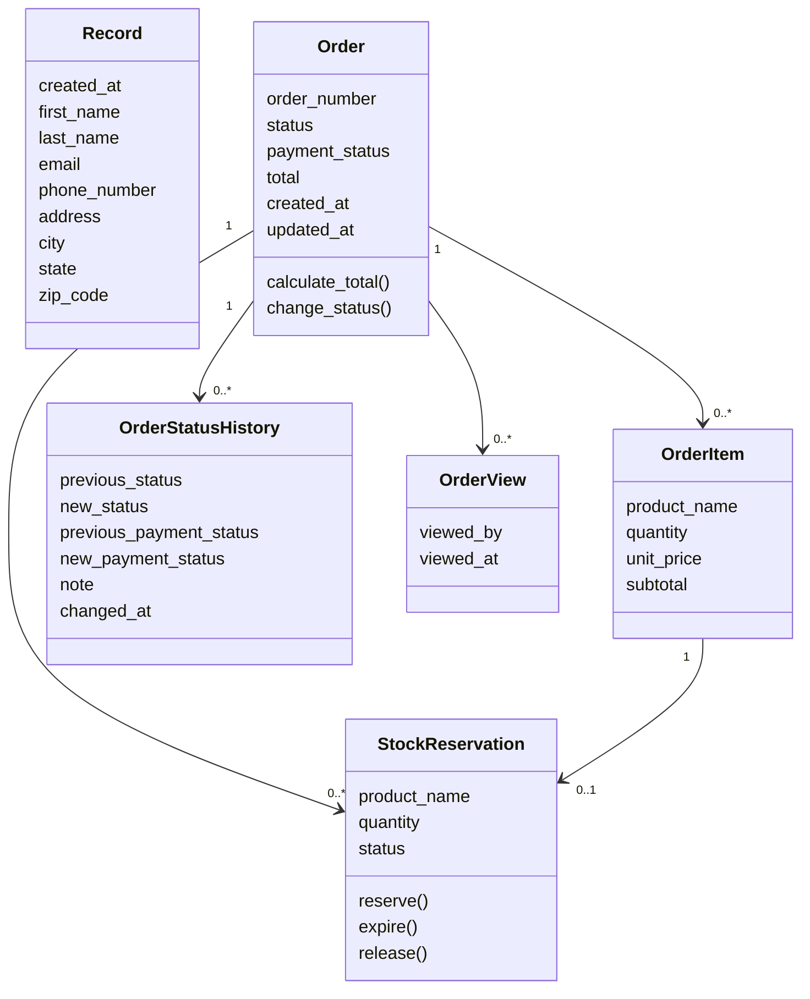

# AngelowDjangoOrders

**Sistema web Django para gestión de clientes, pedidos, ítems, estados, reservas de stock y auditoría de cambios.**

El proyecto implementa autenticación, roles administrativos, formularios validados, vistas protegidas, plantillas Bootstrap, persistencia MySQL y documentación arquitectónica C4/UML.

**Repositorio:** https://github.com/Braian551/AngelowDjangoOrders

**Ejecución local:** http://127.0.0.1:8000/

**Panel admin:** http://127.0.0.1:8000/admin/

---

## Tabla de contenidos

* [Descripción](#descripción)
* [Funcionalidades principales](#funcionalidades-principales)
* [Tecnologías](#tecnologías)
* [Arquitectura del software](#arquitectura-del-software)
* [Flujo principal](#flujo-principal)
* [Modelo de dominio](#modelo-de-dominio)
* [Rutas del sistema](#rutas-del-sistema)
* [Patrones de diseño](#patrones-de-diseño)
* [Documentación técnica](#documentación-técnica)
* [Requisitos](#requisitos)
* [Instalación local](#instalación-local)
* [Ejecución con Docker](#ejecución-con-docker)
* [Pruebas y validación](#pruebas-y-validación)
* [Estructura del proyecto](#estructura-del-proyecto)
* [Seguridad](#seguridad)
* [ISO/IEC 25010](#isoiec-25010)
* [Limitaciones](#limitaciones)
* [Licencia](#licencia)

---

## Descripción

Angelow es una aplicación web construida con Django para administrar clientes y pedidos. El sistema separa responsabilidades por módulos: modelos para datos y reglas de dominio, formularios para validación de entrada, vistas para coordinar el flujo HTTP y plantillas para la interfaz.

El módulo de pedidos permite crear, editar, listar y eliminar pedidos con múltiples productos. Cada pedido calcula su total desde sus ítems, sincroniza reservas de stock y registra historial cuando cambian el estado del pedido o el estado de pago.

---

## Funcionalidades principales

* Registro, inicio y cierre de sesión de usuarios.
* Redirección por rol: Admin entra al módulo de pedidos; Cliente entra al dashboard.
* CRUD de registros de clientes.
* CRUD de pedidos protegido para usuarios Admin.
* Formset de ítems para agregar varios productos en un solo pedido.
* Cálculo automático del total del pedido desde cantidad y precio unitario.
* Reservas de stock sincronizadas por ítem de pedido.
* Historial automático de estados mediante signals de Django.
* Registro de visualizaciones de pedidos.
* Validaciones de formularios con mensajes en español.
* Protección CSRF y vista personalizada para errores de formulario expirado.
* Docker Compose con servicio web Django y base de datos MySQL.
* Diagramas C4, UML y documentación de patrones.

---

## Tecnologías

| Capa          | Tecnología                   | Uso                                                 |
| ------------- | ---------------------------- | --------------------------------------------------- |
| Backend       | Django 5.2.8                 | Framework web principal                             |
| Lenguaje      | Python 3.14                  | Runtime usado por Dockerfile                        |
| Base de datos | MySQL 8.4                    | Persistencia de clientes, pedidos e historial       |
| Driver DB     | PyMySQL 1.1.2                | Conexión Django con MySQL/MariaDB                   |
| UI            | Django Templates + Bootstrap | Renderizado HTML y estilos                          |
| Contenedores  | Docker + Docker Compose      | Ejecución reproducible de web y base de datos       |
| Documentación | Markdown + diagramas UML     | README, C4, clases y patrones                       |
| Pruebas       | Django TestCase              | Validación de rutas, seguridad, roles y formularios |

---

## Arquitectura del software

### Django MTV con módulos de negocio


### Responsabilidades por capa

| Capa            | Archivos                                                   | Responsabilidad                                                    |
| --------------- | ---------------------------------------------------------- | ------------------------------------------------------------------ |
| Proyecto Django | `dcrm/dcrm/settings.py`, `dcrm/dcrm/urls.py`               | Configuración global, seguridad, base de datos y enrutamiento raíz |
| App principal   | `dcrm/website/`                                            | Clientes, pedidos, autenticación y plantillas                      |
| Modelos         | `dcrm/website/models/`                                     | Estructura de datos, relaciones y reglas de dominio                |
| Formularios     | `dcrm/website/forms/`                                      | Validación, widgets, mensajes y formsets                           |
| Vistas          | `dcrm/website/views/`                                      | Flujo HTTP, permisos, renderizado y redirecciones                  |
| Signals         | `dcrm/website/signals.py`                                  | Historial automático de cambios de pedido                          |
| Plantillas      | `dcrm/website/templates/`                                  | Interfaz HTML y recursos estáticos                                 |
| Docker          | `Dockerfile`, `docker-compose.yml`, `docker/entrypoint.sh` | Construcción, migraciones y ejecución                              |

### Modelo C4 en Mermaid

Los siguientes diagramas muestran las 4C del sistema: contexto, contenedores, componentes y código. Las fuentes editables en PlantUML también están disponibles en `docs/arquitectura/`.

#### C1 - Contexto



#### C2 - Contenedores



#### C3 - Componentes



#### C4 - Código



---

## Flujo principal

### Autenticación y redirección por rol



### Creación de pedido



---

## Modelo de dominio

| Modelo               | Propósito                           | Relaciones clave                                   |
| -------------------- | ----------------------------------- | -------------------------------------------------- |
| `Record`             | Datos de clientes                   | Independiente                                      |
| `Order`              | Pedido principal                    | Tiene ítems, historial, reservas y visualizaciones |
| `OrderItem`          | Producto dentro de un pedido        | Pertenece a un `Order`                             |
| `OrderStatusHistory` | Auditoría de cambios de estado/pago | Pertenece a un `Order`                             |
| `StockReservation`   | Reserva de stock por ítem           | Pertenece a `Order` y a un `OrderItem`             |
| `OrderView`          | Registro de visualización de pedido | Pertenece a un `Order`                             |



---

## Rutas del sistema

| Ruta                         | Vista             | Descripción                                    |
| ---------------------------- | ----------------- | ---------------------------------------------- |
| `/`                          | `home`            | Dashboard de clientes para usuario autenticado |
| `/login/`                    | `login_user`      | Inicio de sesión                               |
| `/logout/`                   | `logout_user`     | Cierre de sesión                               |
| `/registrar/`                | `register_user`   | Registro de usuario                            |
| `/record/<pk>/`              | `customer_record` | Detalle de cliente                             |
| `/delete_record/<pk>/`       | `delete_record`   | Eliminación de cliente                         |
| `/update_record/<pk>/`       | `update_record`   | Edición de cliente                             |
| `/orders/`                   | `list_orders`     | Listado de pedidos, solo Admin                 |
| `/orders/create/`            | `create_order`    | Creación de pedido, solo Admin                 |
| `/orders/<order_id>/edit/`   | `update_order`    | Edición de pedido, solo Admin                  |
| `/orders/<order_id>/delete/` | `delete_order`    | Eliminación de pedido, solo Admin              |
| `/admin/`                    | Django Admin      | Administración nativa de Django                |

---

## Patrones de diseño

El proyecto documenta 10 patrones y convenciones. No todos son GoF puros: algunos son patrones GoF, otros son aplicaciones simples del patrón y otros son convenciones propias de Django.

| Patrón                  | Tipo                           | Dónde aparece                                                             |
| ----------------------- | ------------------------------ | ------------------------------------------------------------------------- |
| Observer                | GoF                            | `website/signals.py` escucha `pre_save` y `post_save`                     |
| Decorator               | GoF                            | `login_required`, `user_passes_test`, `never_cache`, `ensure_csrf_cookie` |
| State                   | GoF aplicado de forma simple   | `Order.status`, `Order.payment_status`, `StockReservation.status`         |
| Factory Method          | GoF aplicado con helper Django | `inlineformset_factory()` crea `OrderItemFormSet`                         |
| Strategy                | GoF usado de forma sencilla    | `is_admin_user()` y `get_login_redirect_url()` encapsulan reglas          |
| Facade                  | Estructural                    | Vistas de pedidos coordinan formularios, modelos, reservas y mensajes     |
| Template Method         | GoF aplicado por Django Forms  | `is_valid()` llama `clean_*()` y `clean()`                                |
| MTV                     | Arquitectónico Django          | Models, Templates y Views                                                 |
| ORM / Active Record     | Persistencia Django            | Modelos heredan de `models.Model` y usan `objects`                        |
| ModelForm / Form Object | Convención Django              | Formularios encapsulan entrada, validación y guardado                     |

Documentación completa: [`docs/patrones/patrones_diseno.md`](docs/patrones/patrones_diseno.md)

Diagramas de patrones:

* [Observer](docs/patrones/Patron%20Observer%20-%20Historial%20automatico%20de%20pedidos.png)
* [Decorator](docs/patrones/Patron%20Decorator%20-%20Proteccion%20de%20vistas%20de%20pedidos.png)
* [State](docs/patrones/Patron%20State%20-%20Estados%20simples%20con%20choices%20de%20Django.png)
* [ModelForm / Form Object](docs/patrones/Patron%20ModelForm%20-%20Form%20Object%20-%20Validacion%20antes%20de%20persistir.png)

---

## Documentación técnica

| Documento                  | Archivo                                                                |
| -------------------------- | ---------------------------------------------------------------------- |
| Diagrama C1 - Contexto     | [`docs/arquitectura/c1.png`](docs/arquitectura/c1.png)                 |
| Diagrama C2 - Contenedores | [`docs/arquitectura/c2.png`](docs/arquitectura/c2.png)                 |
| Diagrama C3 - Componentes  | [`docs/arquitectura/c3.png`](docs/arquitectura/c3.png)                 |
| Diagrama C4 - Código       | [`docs/arquitectura/c4.png`](docs/arquitectura/c4.png)                 |
| Diagrama de clases         | [`docs/Diagrama de clases.png`](docs/Diagrama%20de%20clases.png)       |
| Patrones de diseño         | [`docs/patrones/patrones_diseno.md`](docs/patrones/patrones_diseno.md) |

---

## Requisitos

### Opción Docker

* Docker
* Docker Compose

### Opción local

* Python 3.14 o versión compatible con Django 5.2
* MySQL o MariaDB
* `pip`
* Entorno virtual recomendado

Dependencias principales:

```text
Django==5.2.8
PyMySQL==1.1.2
cryptography==46.0.3
python-dotenv==1.0.1
sqlparse==0.4.4
```

---

## Instalación local

```powershell
# 1. Clonar el repositorio
git clone https://github.com/Braian551/AngelowDjangoOrders.git
cd AngelowDjangoOrders

# 2. Crear y activar entorno virtual
py -3.14 -m venv .venv
.\.venv\Scripts\Activate.ps1

# 3. Instalar dependencias
python -m pip install --upgrade pip
pip install -r requirements.txt

# 4. Configurar variables para MySQL local
$env:DJANGO_DB_NAME="clientes"
$env:DJANGO_DB_USER="root"
$env:DJANGO_DB_PASSWORD=""
$env:DJANGO_DB_HOST="localhost"
$env:DJANGO_DB_PORT="3306"

# 5. Ejecutar migraciones y servidor
cd dcrm
python manage.py migrate
python manage.py createsuperuser
python manage.py runserver
```

Abrir en el navegador:

```text
http://127.0.0.1:8000/
```

---

## Ejecución con Docker

Docker Compose crea dos servicios:

| Servicio | Contenedor    | Puerto      | Función   |
| -------- | ------------- | ----------- | --------- |
| `web`    | `angelow-web` | `8000:8000` | Django    |
| `db`     | `angelow-db`  | `3307:3306` | MySQL 8.4 |

```powershell
# Construir y levantar servicios
docker compose up -d --build

# Ver estado
docker compose ps

# Ver logs del servicio web
docker compose logs -f web
```

El entrypoint ejecuta migraciones automáticamente antes de iniciar Django:

```sh
python manage.py migrate --noinput
python manage.py runserver 0.0.0.0:8000
```

---

## Pruebas y validación

```powershell
cd dcrm

# Verificación de configuración Django
python manage.py check

# Pruebas de la app website
python manage.py test website
```

Las pruebas cubren:

* Formulario de login.
* Persistencia de sesión.
* Redirección por rol Admin/Cliente.
* Protección de módulo de pedidos.
* Configuración de seguridad local.
* Mensajes de validación en español.
* Validaciones de registro, clientes y pedidos.
* Cálculo de totales de pedidos.
* Creación de pedidos con múltiples ítems.

---

## Estructura del proyecto

```text
AngelowDjangoOrders/
├── dcrm/
│   ├── manage.py
│   ├── dcrm/
│   │   ├── settings.py
│   │   ├── urls.py
│   │   ├── asgi.py
│   │   └── wsgi.py
│   └── website/
│       ├── admin.py
│       ├── apps.py
│       ├── signals.py
│       ├── tests.py
│       ├── urls.py
│       ├── forms/
│       │   ├── order_form.py
│       │   ├── record_form.py
│       │   └── signup_form.py
│       ├── models/
│       │   ├── order.py
│       │   └── record.py
│       ├── views/
│       │   ├── auth_views.py
│       │   ├── helpers.py
│       │   ├── order_views.py
│       │   └── record_views.py
│       └── templates/
│           ├── base.html
│           ├── home.html
│           ├── login.html
│           ├── register.html
│           ├── record.html
│           ├── update_record.html
│           ├── orders/
│           ├── partials/
│           └── static/
├── docker/
│   └── entrypoint.sh
├── docs/
│   ├── Diagrama de clases.png
│   ├── arquitectura/
│   └── patrones/
├── Dockerfile
├── docker-compose.yml
├── requirements.txt
└── README.md
```

---

## Seguridad

| Mecanismo             | Implementación                                                  |
| --------------------- | --------------------------------------------------------------- |
| Autenticación         | `authenticate()`, `login()`, `logout()`                         |
| Autorización          | `user_passes_test(is_admin_user)` para pedidos                  |
| CSRF                  | Middleware Django y `ensure_csrf_cookie`                        |
| Error CSRF legible    | `CSRF_FAILURE_VIEW = 'website.views.csrf_failure'`              |
| Sesión                | Cookies HTTPOnly, SameSite Lax y expiración al cerrar navegador |
| Cabeceras             | `X_FRAME_OPTIONS = 'DENY'`, `SECURE_CONTENT_TYPE_NOSNIFF`       |
| Validación de entrada | Regex y errores personalizados en formularios                   |
| Auditoría             | `OrderStatusHistory` vía signals                                |

---

## ISO/IEC 25010

| Característica       | Evidencia en el proyecto                                       |
| -------------------- | -------------------------------------------------------------- |
| Adecuación funcional | CRUD de clientes y pedidos, roles, historial y reservas        |
| Usabilidad           | Plantillas Bootstrap, mensajes en español y flujos PRG         |
| Seguridad            | CSRF, sesiones, roles, validación y cabeceras                  |
| Mantenibilidad       | Separación por models/forms/views/templates y documentación C4 |
| Fiabilidad           | Pruebas automatizadas y validaciones de formularios            |
| Portabilidad         | Dockerfile y Docker Compose                                    |
| Compatibilidad       | Django + MySQL con variables de entorno                        |

---

## Limitaciones

* El proyecto está configurado para desarrollo local con `DEBUG = True`.
* No hay URL pública de despliegue documentada en el repositorio.
* La base de datos local requiere MySQL/MariaDB disponible o Docker Compose.
* Para producción se debe mover `SECRET_KEY`, `DEBUG`, `ALLOWED_HOSTS` y credenciales a variables de entorno seguras.
* Los diagramas de documentación están exportados como imágenes; si se necesitan fuentes editables, conviene conservar también los archivos `.puml`.

---

## Licencia

Proyecto académico.
