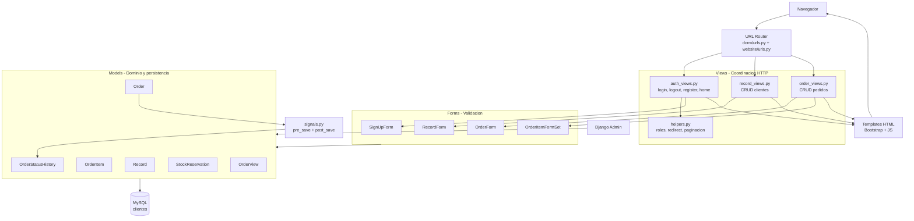
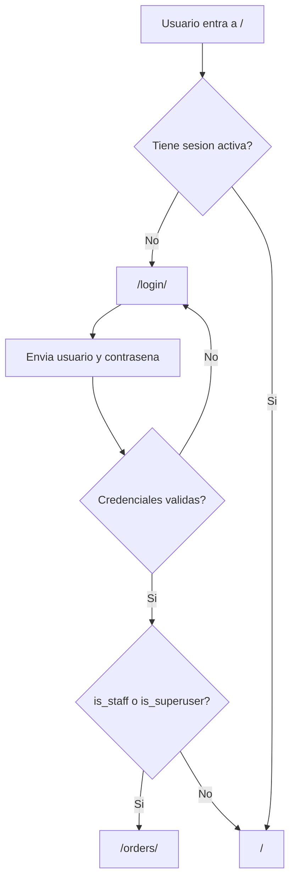
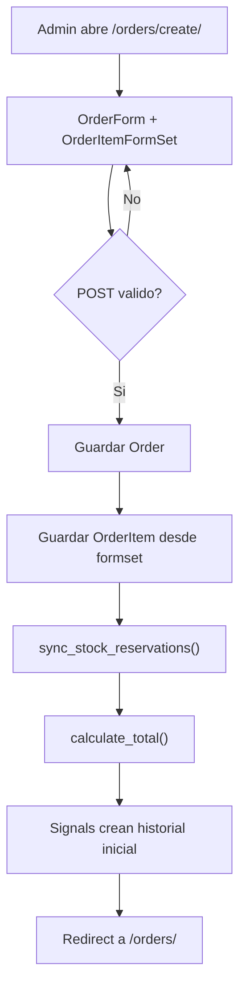
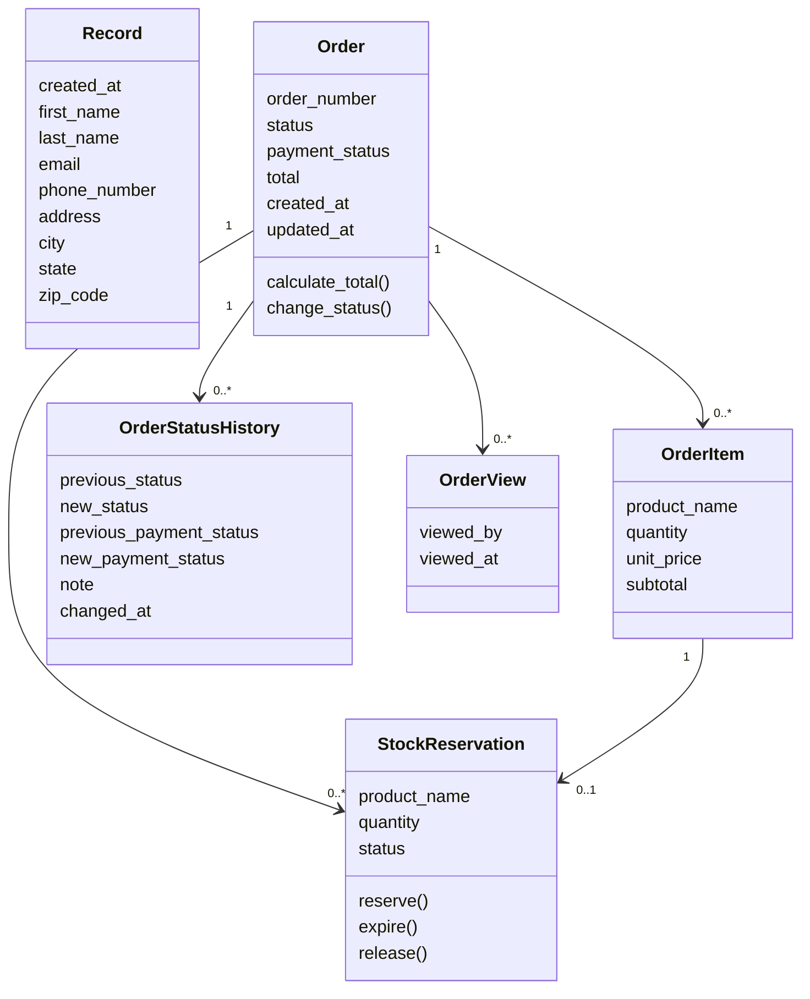

# AngelowDjangoOrders

**Sistema web Django para gestion de clientes, pedidos, items, estados, reservas de stock y auditoria de cambios.**

El proyecto implementa autenticacion, roles administrativos, formularios validados, vistas protegidas, templates Bootstrap, persistencia MySQL y documentacion arquitectonica C4/UML.

**Repositorio:** https://github.com/Braian551/AngelowDjangoOrders

**Ejecucion local:** http://127.0.0.1:8000/

**Panel admin:** http://127.0.0.1:8000/admin/

---

## Tabla de contenidos

- [Descripcion](#descripcion)
- [Funcionalidades principales](#funcionalidades-principales)
- [Tecnologias](#tecnologias)
- [Arquitectura del software](#arquitectura-del-software)
- [Flujo principal](#flujo-principal)
- [Modelo de dominio](#modelo-de-dominio)
- [Rutas del sistema](#rutas-del-sistema)
- [Patrones de diseno](#patrones-de-diseno)
- [Documentacion tecnica](#documentacion-tecnica)
- [Requisitos](#requisitos)
- [Instalacion local](#instalacion-local)
- [Ejecucion con Docker](#ejecucion-con-docker)
- [Pruebas y validacion](#pruebas-y-validacion)
- [Estructura del proyecto](#estructura-del-proyecto)
- [Seguridad](#seguridad)
- [ISO/IEC 25010](#isoiec-25010)
- [Limitaciones](#limitaciones)
- [Licencia](#licencia)

---

## Descripcion

AngelowDjangoOrders es una aplicacion web construida con Django para administrar clientes y pedidos. El sistema separa responsabilidades por modulos: modelos para datos y reglas de dominio, formularios para validacion de entrada, vistas para coordinar el flujo HTTP y templates para la interfaz.

El modulo de pedidos permite crear, editar, listar y eliminar pedidos con multiples productos. Cada pedido calcula su total desde sus items, sincroniza reservas de stock y registra historial cuando cambian el estado del pedido o el estado de pago.

---

## Funcionalidades principales

- Registro, inicio y cierre de sesion de usuarios.
- Redireccion por rol: Admin entra al modulo de pedidos; Cliente entra al dashboard.
- CRUD de registros de clientes.
- CRUD de pedidos protegido para usuarios Admin.
- Formset de items para agregar varios productos en un solo pedido.
- Calculo automatico del total del pedido desde cantidad y precio unitario.
- Reservas de stock sincronizadas por item de pedido.
- Historial automatico de estados mediante signals de Django.
- Registro de visualizaciones de pedidos.
- Validaciones de formularios con mensajes en espanol.
- Proteccion CSRF y vista personalizada para errores de formulario expirado.
- Docker Compose con servicio web Django y base de datos MySQL.
- Diagramas C4, UML y documentacion de patrones.

---

## Tecnologias

| Capa | Tecnologia | Uso |
|---|---|---|
| Backend | Django 5.2.8 | Framework web principal |
| Lenguaje | Python 3.14 | Runtime usado por Dockerfile |
| Base de datos | MySQL 8.4 | Persistencia de clientes, pedidos e historial |
| Driver DB | PyMySQL 1.1.2 | Conexion Django con MySQL/MariaDB |
| UI | Django Templates + Bootstrap | Renderizado HTML y estilos |
| Contenedores | Docker + Docker Compose | Ejecucion reproducible de web y DB |
| Documentacion | Markdown + diagramas UML | README, C4, clases y patrones |
| Pruebas | Django TestCase | Validacion de rutas, seguridad, roles y formularios |

---

## Arquitectura del software

### Django MTV con modulos de negocio



### Responsabilidades por capa

| Capa | Archivos | Responsabilidad |
|---|---|---|
| Proyecto Django | `dcrm/dcrm/settings.py`, `dcrm/dcrm/urls.py` | Configuracion global, seguridad, DB y enrutamiento raiz |
| App principal | `dcrm/website/` | Clientes, pedidos, autenticacion y templates |
| Modelos | `dcrm/website/models/` | Estructura de datos, relaciones y reglas de dominio |
| Formularios | `dcrm/website/forms/` | Validacion, widgets, mensajes y formsets |
| Vistas | `dcrm/website/views/` | Flujo HTTP, permisos, render y redirecciones |
| Signals | `dcrm/website/signals.py` | Historial automatico de cambios de pedido |
| Templates | `dcrm/website/templates/` | Interfaz HTML y recursos estaticos |
| Docker | `Dockerfile`, `docker-compose.yml`, `docker/entrypoint.sh` | Construccion, migraciones y ejecucion |

---

## Flujo principal

### Autenticacion y redireccion por rol



### Creacion de pedido



---

## Modelo de dominio

| Modelo | Proposito | Relaciones clave |
|---|---|---|
| `Record` | Datos de clientes | Independiente |
| `Order` | Pedido principal | Tiene items, historial, reservas y visualizaciones |
| `OrderItem` | Producto dentro de un pedido | Pertenece a un `Order` |
| `OrderStatusHistory` | Auditoria de cambios de estado/pago | Pertenece a un `Order` |
| `StockReservation` | Reserva de stock por item | Pertenece a `Order` y a un `OrderItem` |
| `OrderView` | Registro de visualizacion de pedido | Pertenece a un `Order` |



---

## Rutas del sistema

| Ruta | Vista | Descripcion |
|---|---|---|
| `/` | `home` | Dashboard de clientes para usuario autenticado |
| `/login/` | `login_user` | Inicio de sesion |
| `/logout/` | `logout_user` | Cierre de sesion |
| `/registrar/` | `register_user` | Registro de usuario |
| `/record/<pk>/` | `customer_record` | Detalle de cliente |
| `/delete_record/<pk>/` | `delete_record` | Eliminacion de cliente |
| `/update_record/<pk>/` | `update_record` | Edicion de cliente |
| `/orders/` | `list_orders` | Listado de pedidos, solo Admin |
| `/orders/create/` | `create_order` | Creacion de pedido, solo Admin |
| `/orders/<order_id>/edit/` | `update_order` | Edicion de pedido, solo Admin |
| `/orders/<order_id>/delete/` | `delete_order` | Eliminacion de pedido, solo Admin |
| `/admin/` | Django Admin | Administracion nativa de Django |

---

## Patrones de diseno

El proyecto documenta 10 patrones y convenciones. No todos son GoF puros: algunos son patrones GoF, otros son aplicaciones simples del patron y otros son convenciones propias de Django.

| Patron | Tipo | Donde aparece |
|---|---|---|
| Observer | GoF | `website/signals.py` escucha `pre_save` y `post_save` |
| Decorator | GoF | `login_required`, `user_passes_test`, `never_cache`, `ensure_csrf_cookie` |
| State | GoF aplicado de forma simple | `Order.status`, `Order.payment_status`, `StockReservation.status` |
| Factory Method | GoF aplicado con helper Django | `inlineformset_factory()` crea `OrderItemFormSet` |
| Strategy | GoF usado de forma sencilla | `is_admin_user()` y `get_login_redirect_url()` encapsulan reglas |
| Facade | Estructural | Vistas de pedidos coordinan formularios, modelos, reservas y mensajes |
| Template Method | GoF aplicado por Django Forms | `is_valid()` llama `clean_*()` y `clean()` |
| MTV | Arquitectonico Django | Models, Templates y Views |
| ORM / Active Record | Persistencia Django | Modelos heredan de `models.Model` y usan `objects` |
| ModelForm / Form Object | Convencion Django | Formularios encapsulan entrada, validacion y guardado |

Documentacion completa: [`docs/patrones/patrones_diseno.md`](docs/patrones/patrones_diseno.md)

Diagramas de patrones:

- [Observer](docs/patrones/Patron%20Observer%20-%20Historial%20automatico%20de%20pedidos.png)
- [Decorator](docs/patrones/Patron%20Decorator%20-%20Proteccion%20de%20vistas%20de%20pedidos.png)
- [State](docs/patrones/Patron%20State%20-%20Estados%20simples%20con%20choices%20de%20Django.png)
- [ModelForm / Form Object](docs/patrones/Patron%20ModelForm%20-%20Form%20Object%20-%20Validacion%20antes%20de%20persistir.png)

---

## Documentacion tecnica

| Documento | Archivo |
|---|---|
| Diagrama C1 - Contexto | [`docs/arquitectura/c1.png`](docs/arquitectura/c1.png) |
| Diagrama C2 - Contenedores | [`docs/arquitectura/c2.png`](docs/arquitectura/c2.png) |
| Diagrama C3 - Componentes | [`docs/arquitectura/c3.png`](docs/arquitectura/c3.png) |
| Diagrama C4 - Codigo | [`docs/arquitectura/c4.png`](docs/arquitectura/c4.png) |
| Diagrama de clases | [`docs/Diagrama de clases.png`](docs/Diagrama%20de%20clases.png) |
| Patrones de diseno | [`docs/patrones/patrones_diseno.md`](docs/patrones/patrones_diseno.md) |

---

## Requisitos

### Opcion Docker

- Docker
- Docker Compose

### Opcion local

- Python 3.14 o version compatible con Django 5.2
- MySQL o MariaDB
- `pip`
- Entorno virtual recomendado

Dependencias principales:

```text
Django==5.2.8
PyMySQL==1.1.2
cryptography==46.0.3
python-dotenv==1.0.1
sqlparse==0.4.4
```

---

## Instalacion local

```powershell
# 1. Clonar el repositorio
git clone https://github.com/Braian551/AngelowDjangoOrders.git
cd AngelowDjangoOrders

# 2. Crear y activar entorno virtual
py -3.14 -m venv .venv
.\.venv\Scripts\Activate.ps1

# 3. Instalar dependencias
python -m pip install --upgrade pip
pip install -r requirements.txt

# 4. Configurar variables para MySQL local
$env:DJANGO_DB_NAME="clientes"
$env:DJANGO_DB_USER="root"
$env:DJANGO_DB_PASSWORD=""
$env:DJANGO_DB_HOST="localhost"
$env:DJANGO_DB_PORT="3306"

# 5. Ejecutar migraciones y servidor
cd dcrm
python manage.py migrate
python manage.py createsuperuser
python manage.py runserver
```

Abrir en el navegador:

```text
http://127.0.0.1:8000/
```

---

## Ejecucion con Docker

Docker Compose crea dos servicios:

| Servicio | Contenedor | Puerto | Funcion |
|---|---|---|---|
| `web` | `angelow-web` | `8000:8000` | Django |
| `db` | `angelow-db` | `3307:3306` | MySQL 8.4 |

```powershell
# Construir y levantar servicios
docker compose up -d --build

# Ver estado
docker compose ps

# Ver logs del servicio web
docker compose logs -f web
```

El entrypoint ejecuta migraciones automaticamente antes de iniciar Django:

```sh
python manage.py migrate --noinput
python manage.py runserver 0.0.0.0:8000
```

---

## Pruebas y validacion

```powershell
cd dcrm

# Verificacion de configuracion Django
python manage.py check

# Pruebas de la app website
python manage.py test website
```

Las pruebas cubren:

- Formulario de login.
- Persistencia de sesion.
- Redireccion por rol Admin/Cliente.
- Proteccion de modulo de pedidos.
- Configuracion de seguridad local.
- Mensajes de validacion en espanol.
- Validaciones de registro, clientes y pedidos.
- Calculo de totales de pedidos.
- Creacion de pedidos con multiples items.

---

## Estructura del proyecto

```text
AngelowDjangoOrders/
├── dcrm/
│   ├── manage.py
│   ├── dcrm/
│   │   ├── settings.py
│   │   ├── urls.py
│   │   ├── asgi.py
│   │   └── wsgi.py
│   └── website/
│       ├── admin.py
│       ├── apps.py
│       ├── signals.py
│       ├── tests.py
│       ├── urls.py
│       ├── forms/
│       │   ├── order_form.py
│       │   ├── record_form.py
│       │   └── signup_form.py
│       ├── models/
│       │   ├── order.py
│       │   └── record.py
│       ├── views/
│       │   ├── auth_views.py
│       │   ├── helpers.py
│       │   ├── order_views.py
│       │   └── record_views.py
│       └── templates/
│           ├── base.html
│           ├── home.html
│           ├── login.html
│           ├── register.html
│           ├── record.html
│           ├── update_record.html
│           ├── orders/
│           ├── partials/
│           └── static/
├── docker/
│   └── entrypoint.sh
├── docs/
│   ├── Diagrama de clases.png
│   ├── arquitectura/
│   └── patrones/
├── Dockerfile
├── docker-compose.yml
├── requirements.txt
└── README.md
```

---

## Seguridad

| Mecanismo | Implementacion |
|---|---|
| Autenticacion | `authenticate()`, `login()`, `logout()` |
| Autorizacion | `user_passes_test(is_admin_user)` para pedidos |
| CSRF | Middleware Django y `ensure_csrf_cookie` |
| Error CSRF legible | `CSRF_FAILURE_VIEW = 'website.views.csrf_failure'` |
| Sesion | Cookies HTTPOnly, SameSite Lax y expiracion al cerrar navegador |
| Cabeceras | `X_FRAME_OPTIONS = 'DENY'`, `SECURE_CONTENT_TYPE_NOSNIFF` |
| Validacion de entrada | Regex y errores personalizados en formularios |
| Auditoria | `OrderStatusHistory` via signals |

---

## ISO/IEC 25010

| Caracteristica | Evidencia en el proyecto |
|---|---|
| Adecuacion funcional | CRUD de clientes y pedidos, roles, historial y reservas |
| Usabilidad | Templates Bootstrap, mensajes en espanol y flujos PRG |
| Seguridad | CSRF, sesiones, roles, validacion y cabeceras |
| Mantenibilidad | Separacion por models/forms/views/templates y docs C4 |
| Fiabilidad | Pruebas automatizadas y validaciones de formularios |
| Portabilidad | Dockerfile y Docker Compose |
| Compatibilidad | Django + MySQL con variables de entorno |

---

## Limitaciones

- El proyecto esta configurado para desarrollo local con `DEBUG = True`.
- No hay URL publica de despliegue documentada en el repositorio.
- La base de datos local requiere MySQL/MariaDB disponible o Docker Compose.
- Para produccion se debe mover `SECRET_KEY`, `DEBUG`, `ALLOWED_HOSTS` y credenciales a variables de entorno seguras.
- Los diagramas de documentacion estan exportados como imagenes; si se necesitan fuentes editables, conviene conservar tambien los archivos `.puml`.

---

## Licencia

Proyecto academico. Agrega una licencia explicita si el repositorio sera publicado para uso externo o colaborativo.
