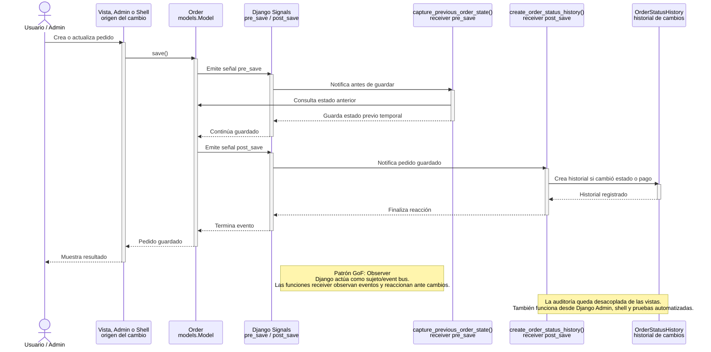
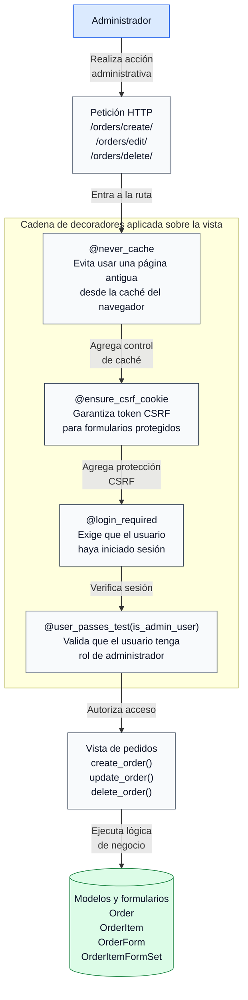
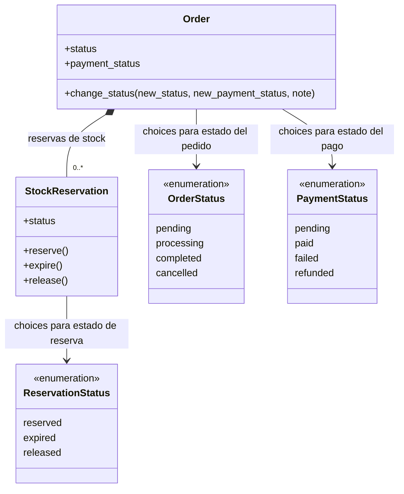
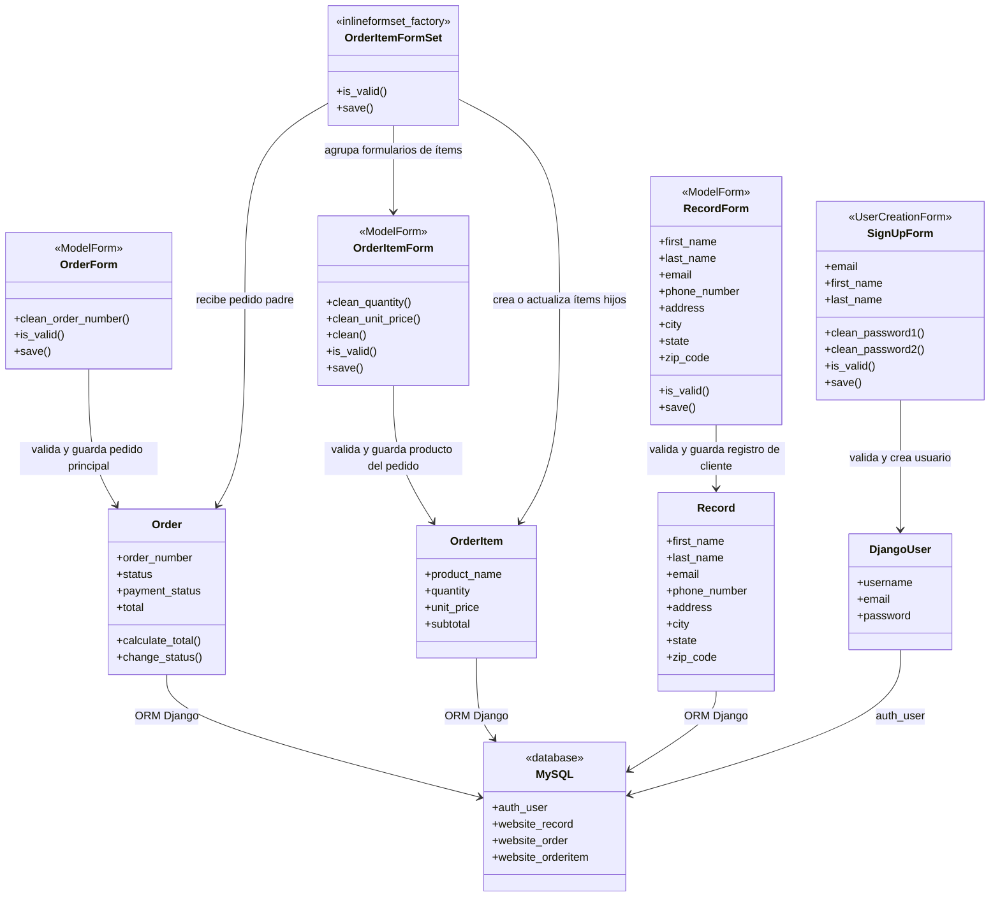

# Patrones de Diseño en AngelowDjangoOrders

## 1. Propósito del documento

Este documento explica los patrones de diseño y patrones arquitectónicos identificados en el proyecto **AngelowDjangoOrders**. La intención no es forzar todos los ejemplos al catálogo GoF, sino describir con precisión cómo el código usa:

* Patrones GoF clásicos.
* Aplicaciones simples de patrones GoF adaptadas a Django.
* Convenciones propias del framework que cumplen una función similar a patrones reconocidos.
* Patrones arquitectónicos y de persistencia presentes en aplicaciones web Django.

El sistema analizado es una aplicación web Django para gestión de usuarios, clientes, pedidos, ítems de pedido, reservas de stock, historial de estados y registro de visualizaciones.

---

## 2. Criterio de clasificación

No todos los patrones del proyecto tienen el mismo nivel de pureza formal. Para evitar ambigüedades, este documento usa la siguiente clasificación:

| Clasificación                    | Significado                                                                                           |
| -------------------------------- | ----------------------------------------------------------------------------------------------------- |
| **GoF directo**                  | El patrón aparece de forma cercana a la definición del catálogo Gang of Four.                         |
| **GoF aplicado de forma simple** | El proyecto usa la idea principal del patrón, pero con una implementación ligera o apoyada en Django. |
| **Patrón arquitectónico**        | Organiza capas o componentes del sistema, aunque no sea GoF.                                          |
| **Convención Django**            | Es una solución propia del framework que concentra responsabilidades y evita duplicación.             |
| **Patrón de persistencia**       | Describe la forma en que se modelan y consultan los datos.                                            |

---

## 3. Resumen de patrones

| #  | Patrón                  | Clasificación                           | Archivos principales                              | Uso en el sistema                                                           |
| -- | ----------------------- | --------------------------------------- | ------------------------------------------------- | --------------------------------------------------------------------------- |
| 1  | Observer                | GoF directo                             | `dcrm/website/signals.py`, `dcrm/website/apps.py` | Crea historial cuando un pedido se crea o cambia de estado.                 |
| 2  | Decorator               | GoF directo, aplicado con Python/Django | `dcrm/website/views/order_views.py`               | Agrega autenticación, autorización, CSRF y control de caché a vistas.       |
| 3  | State                   | GoF aplicado de forma simple            | `dcrm/website/models/order.py`                    | Controla estados válidos de pedidos, pagos y reservas.                      |
| 4  | Factory Method          | GoF aplicado mediante helper Django     | `dcrm/website/forms/order_form.py`                | Construye el formset de ítems con `inlineformset_factory()`.                |
| 5  | Strategy                | GoF aplicado de forma simple            | `dcrm/website/views/helpers.py`                   | Encapsula reglas de rol y redirección.                                      |
| 6  | Facade                  | GoF estructural aplicado al flujo web   | `dcrm/website/views/order_views.py`               | Las vistas coordinan formularios, modelos, reservas, totales y mensajes.    |
| 7  | Template Method         | GoF aplicado por el framework           | `dcrm/website/forms/`                             | Django define el flujo de validación y el proyecto personaliza `clean_*()`. |
| 8  | MTV                     | Patrón arquitectónico Django            | `models/`, `views/`, `templates/`                 | Separa dominio, coordinación HTTP e interfaz.                               |
| 9  | ORM / Active Record     | Patrón de persistencia                  | `dcrm/website/models/`                            | Los modelos representan tablas y exponen operaciones de persistencia.       |
| 10 | ModelForm / Form Object | Convención Django                       | `dcrm/website/forms/`                             | Encapsula entrada de usuario, widgets, etiquetas y validaciones.            |

---

## 4. Diagramas disponibles

En la carpeta `docs/patrones/` se incluyen diagramas exportados como imágenes PNG y sus fuentes PlantUML (`.puml`). Estos diagramas representan los patrones más importantes del proyecto:

| Patrón                  | Diagrama                                                                                                                                                   |
| ----------------------- | ---------------------------------------------------------------------------------------------------------------------------------------------------------- |
| Observer                | [Patrón Observer - Historial automático de pedidos.png](Patron%20Observer%20-%20Historial%20automatico%20de%20pedidos.png)                                 |
| Decorator               | [Patrón Decorator - Protección de vistas de pedidos.png](Patron%20Decorator%20-%20Proteccion%20de%20vistas%20de%20pedidos.png)                             |
| State                   | [Patrón State - Estados simples con choices de Django.png](Patron%20State%20-%20Estados%20simples%20con%20choices%20de%20Django.png)                       |
| ModelForm / Form Object | [Patrón ModelForm - Form Object - Validación antes de persistir.png](Patron%20ModelForm%20-%20Form%20Object%20-%20Validacion%20antes%20de%20persistir.png) |

| Patrón                  | Fuente PlantUML                                            |
| ----------------------- | ---------------------------------------------------------- |
| Observer                | [`observer.puml`](observer.puml)                           |
| Decorator               | [`decorator.puml`](decorator.puml)                         |
| State                   | [`state.puml`](state.puml)                                 |
| ModelForm / Form Object | [`modelform_form_object.puml`](modelform_form_object.puml) |

### 4.1 Diagramas en Mermaid

Los siguientes bloques son la versión Mermaid embebida en este documento para visualización directa en GitHub.

#### Observer - Historial automático de pedidos



#### Decorator - Protección de vistas de pedidos



#### State - Estados simples con choices de Django



#### ModelForm / Form Object - Validación antes de persistir



---

## 5. Patrón Observer

### 5.1 Intención

Observer permite que un objeto o componente reaccione automáticamente cuando ocurre un evento en otro objeto, sin que ambos queden fuertemente acoplados. En Django, este patrón aparece de forma natural mediante **signals**.

### 5.2 Ubicación en el proyecto

* `dcrm/website/signals.py`
* `dcrm/website/apps.py`
* `dcrm/website/models/order.py`

### 5.3 Participantes

| Rol en el patrón      | Implementación                                                     |
| --------------------- | ------------------------------------------------------------------ |
| Subject / Emisor      | Modelo `Order`                                                     |
| Evento observado      | `pre_save` y `post_save`                                           |
| Observer / Suscriptor | `capture_previous_order_state()` y `create_order_status_history()` |
| Resultado             | Creación de `OrderStatusHistory`                                   |
| Registro de observers | Método `ready()` en `WebsiteConfig`                                |

### 5.4 Cómo se aplica

Cuando un pedido se guarda, Django emite eventos internos. El proyecto escucha dos momentos:

1. `pre_save`: antes de guardar, se consulta el estado anterior del pedido.
2. `post_save`: después de guardar, se compara el estado anterior contra el nuevo.

Si el pedido es nuevo, se registra un historial inicial con la nota `Pedido creado`. Si el pedido ya existía y cambia el estado del pedido o del pago, se crea un registro de historial con la nota `Pedido actualizado`.

### 5.5 Flujo

```text
Order.save()
    -> pre_save
        -> capture_previous_order_state()
        -> guarda temporalmente estado anterior y pago anterior
    -> persistencia en base de datos
    -> post_save
        -> create_order_status_history()
        -> crea OrderStatusHistory si corresponde
```

### 5.6 Beneficios

* La auditoría no depende de que cada vista recuerde crear historial.
* Los cambios realizados desde vistas, admin, shell o cualquier otro punto siguen generando historial.
* Se reduce duplicación de lógica transversal.
* El modelo `OrderStatusHistory` queda como bitácora separada y consultable.

### 5.7 Límites de la implementación

El método `Order.change_status()` también crea historial manualmente. Como las signals también crean historial cuando cambia el estado, existe riesgo de duplicar registros si se usa `change_status()` en algún flujo futuro. Actualmente las vistas usan `form.save()`, por lo que el historial lo manejan principalmente las signals.

---

## 6. Patrón Decorator

### 6.1 Intención

Decorator permite agregar responsabilidades a una función u objeto sin modificar directamente su cuerpo. En Python y Django se aplica con decoradores sobre funciones de vista.

### 6.2 Ubicación en el proyecto

* `dcrm/website/views/order_views.py`
* `dcrm/website/views/auth_views.py`

### 6.3 Participantes

| Decorador                                           | Responsabilidad                                  |
| --------------------------------------------------- | ------------------------------------------------ |
| `login_required(login_url='home')`                  | Exige usuario autenticado.                       |
| `user_passes_test(is_admin_user, login_url='home')` | Permite solo usuarios administradores.           |
| `ensure_csrf_cookie`                                | Asegura disponibilidad de cookie CSRF.           |
| `never_cache`                                       | Evita cachear formularios y pantallas sensibles. |

### 6.4 Cómo se aplica

Las vistas del módulo de pedidos están envueltas por decoradores. Por ejemplo, para crear, editar o eliminar pedidos, primero se validan las condiciones transversales de seguridad y luego se ejecuta la lógica propia de la vista.

```text
Petición HTTP
    -> login_required
    -> user_passes_test(is_admin_user)
    -> ensure_csrf_cookie / never_cache, cuando aplica
    -> create_order(), update_order(), delete_order() o list_orders()
```

### 6.5 Beneficios

* La vista se concentra en el caso de uso principal.
* Las reglas de seguridad quedan declaradas arriba de cada función.
* Es fácil identificar qué rutas requieren rol Admin.
* La misma política puede aplicarse a varias vistas sin repetir condicionales internos.

### 6.6 Evidencia

Las vistas protegidas son:

* `list_orders()`
* `create_order()`
* `update_order()`
* `delete_order()`

### 6.7 Límites de la implementación

El acceso a clientes se valida manualmente dentro de `record_views.py`, no con decoradores. Funciona, pero mezclar ambos estilos puede reducir consistencia. Una mejora sería aplicar `login_required` también en las vistas de clientes.

---

## 7. Patrón State

### 7.1 Intención

State permite que un objeto cambie su comportamiento según su estado interno. En este proyecto se usa una versión simple basada en constantes y `choices` de Django, no una implementación completa con clases separadas por estado.

### 7.2 Ubicación en el proyecto

* `dcrm/website/models/order.py`

### 7.3 Participantes

| Elemento                  | Estados                                           |
| ------------------------- | ------------------------------------------------- |
| `Order.status`            | `pending`, `processing`, `completed`, `cancelled` |
| `Order.payment_status`    | `pending`, `paid`, `failed`, `refunded`           |
| `StockReservation.status` | `reserved`, `expired`, `released`                 |

### 7.4 Cómo se aplica

El modelo `Order` define valores permitidos para el ciclo de vida del pedido y del pago. El modelo `StockReservation` hace lo mismo para reservas de inventario.

Además, existen métodos que encapsulan transiciones:

* `Order.change_status()`
* `StockReservation.reserve()`
* `StockReservation.expire()`
* `StockReservation.release()`

### 7.5 Flujo conceptual de pedido

```text
pending -> processing -> completed
pending -> cancelled
processing -> cancelled
```

El código actual valida que el nuevo estado exista en la lista de `choices`, pero no impone una matriz estricta de transiciones. Por ejemplo, técnicamente podría pasarse de `completed` a `pending` si se guarda ese valor desde un formulario válido.

### 7.6 Beneficios

* Evita estados arbitrarios en base de datos.
* Permite mostrar etiquetas legibles con `get_status_display()`.
* Hace que formularios y admin usen listas controladas.
* Facilita auditar cambios porque los estados tienen vocabulario estable.

### 7.7 Límites de la implementación

No es un State GoF completo porque:

* No existen clases como `PendingState`, `ProcessingState` o `CompletedState`.
* El comportamiento no cambia por polimorfismo.
* Las transiciones permitidas no están modeladas como reglas estrictas.

Es una implementación suficiente para un CRUD administrativo, pero si el negocio crece convendría agregar una matriz de transiciones o clases de estado.

---

## 8. Patrón Factory Method

### 8.1 Intención

Factory Method encapsula la creación de objetos para que el cliente no tenga que conocer todos los detalles de construcción. En este proyecto se aplica mediante el helper `inlineformset_factory()` de Django.

### 8.2 Ubicación en el proyecto

* `dcrm/website/forms/order_form.py`

### 8.3 Participantes

| Rol             | Implementación            |
| --------------- | ------------------------- |
| Factory         | `inlineformset_factory()` |
| Producto creado | `OrderItemFormSet`        |
| Modelo padre    | `Order`                   |
| Modelo hijo     | `OrderItem`               |
| Formulario base | `OrderItemForm`           |

### 8.4 Cómo se aplica

El proyecto necesita editar varios `OrderItem` dentro de un mismo `Order`. En vez de construir manualmente la clase que administra ese conjunto de formularios, se usa:

```text
inlineformset_factory(Order, OrderItem, form=OrderItemForm, extra=1, can_delete=True)
```

Esto genera una clase de formset preparada para:

* Crear ítems hijos.
* Editar ítems existentes.
* Eliminar ítems asociados.
* Mantener la relación padre-hijo con el pedido.

### 8.5 Beneficios

* Reduce código repetitivo.
* Evita errores al manejar relaciones uno-a-muchos.
* Centraliza la configuración del formset.
* Hace que las vistas de pedido trabajen con una interfaz simple: `formset.is_valid()` y `formset.save()`.

### 8.6 Límites de la implementación

Es una aplicación del concepto de Factory Method a través de una API de Django. El proyecto no define una clase factory propia.

---

## 9. Patrón Strategy

### 9.1 Intención

Strategy encapsula una regla o algoritmo para que pueda cambiarse sin modificar el flujo que lo utiliza. En el proyecto se usa para reglas de rol y redirección.

### 9.2 Ubicación en el proyecto

* `dcrm/website/views/helpers.py`
* `dcrm/website/views/auth_views.py`
* `dcrm/website/views/order_views.py`

### 9.3 Participantes

| Estrategia                        | Responsabilidad                                       |
| --------------------------------- | ----------------------------------------------------- |
| `is_admin_user(user)`             | Decide si un usuario es administrador.                |
| `get_login_redirect_url(user)`    | Decide a qué pantalla redirigir después de login.     |
| `user_passes_test(is_admin_user)` | Usa la estrategia para permitir o bloquear una vista. |

### 9.4 Cómo se aplica

La regla para identificar administradores está centralizada:

```text
Admin = usuario autenticado y (is_staff o is_superuser)
```

La vista de login no necesita saber todos los detalles del rol. Solo llama a `get_login_redirect_url(user)`. Las vistas de pedidos tampoco duplican la condición; delegan la decisión en `is_admin_user()`.

### 9.5 Beneficios

* Cambiar la política de roles requiere tocar un solo lugar.
* Evita repetir condiciones en varias vistas.
* Mejora legibilidad de las reglas de negocio.
* Facilita pruebas unitarias de acceso por rol.

### 9.6 Límites de la implementación

Es una estrategia simple implementada con funciones, no con clases intercambiables. Para el tamaño actual del sistema, ese enfoque es adecuado.

---

## 10. Patrón Facade

### 10.1 Intención

Facade ofrece una interfaz simple para coordinar un conjunto de operaciones internas más complejas. En aplicaciones web, una vista puede actuar como fachada de un caso de uso.

### 10.2 Ubicación en el proyecto

* `dcrm/website/views/order_views.py`

### 10.3 Participantes

| Fachada                     | Operaciones internas coordinadas                                                                    |
| --------------------------- | --------------------------------------------------------------------------------------------------- |
| `create_order()`            | Valida formulario, guarda pedido, guarda ítems, sincroniza stock, calcula total y muestra mensajes. |
| `update_order()`            | Carga pedido, registra visualización, valida cambios, guarda ítems, actualiza stock y total.        |
| `delete_order()`            | Carga pedido, registra visualización, confirma eliminación y borra por POST.                        |
| `sync_stock_reservations()` | Encapsula creación/actualización de reservas.                                                       |
| `record_order_view()`       | Encapsula auditoría de visualizaciones.                                                             |

### 10.4 Cómo se aplica

Desde la perspectiva del usuario, crear un pedido es una sola acción. Internamente, el sistema ejecuta varias tareas:

```text
POST /orders/create/
    -> validar OrderForm
    -> validar OrderItemFormSet
    -> guardar Order
    -> asociar y guardar OrderItem
    -> crear/actualizar StockReservation
    -> recalcular total
    -> generar mensajes
    -> redirigir al listado
```

La vista es la fachada que oculta esos detalles y ofrece un flujo único.

### 10.5 Beneficios

* El controlador web ofrece operaciones de alto nivel.
* La complejidad queda encapsulada en funciones auxiliares y modelos.
* La interfaz para el usuario se mantiene simple.
* Es más fácil razonar sobre el caso de uso completo.

### 10.6 Límites de la implementación

Las vistas coordinan varias responsabilidades. Si el módulo crece, podría extraerse una capa de servicios, por ejemplo `OrderService`, para mover lógica de sincronización y cálculo fuera de la vista.

---

## 11. Patrón Template Method

### 11.1 Intención

Template Method define el esqueleto de un algoritmo y permite que algunos pasos sean personalizados por subclases o métodos especializados. En Django Forms, el framework define el flujo de validación y el proyecto personaliza partes concretas.

### 11.2 Ubicación en el proyecto

* `dcrm/website/forms/signup_form.py`
* `dcrm/website/forms/record_form.py`
* `dcrm/website/forms/order_form.py`

### 11.3 Participantes

| Elemento          | Rol                                                   |
| ----------------- | ----------------------------------------------------- |
| `form.is_valid()` | Ejecuta el algoritmo general de validación de Django. |
| `clean_<field>()` | Personaliza validación de un campo específico.        |
| `clean()`         | Personaliza validación cruzada entre campos.          |
| `ValidationError` | Comunica errores al formulario.                       |

### 11.4 Cómo se aplica

Django ejecuta un flujo general como este:

```text
is_valid()
    -> validación de campos requeridos
    -> validadores del campo
    -> clean_<field>()
    -> clean()
    -> construcción de cleaned_data o errors
```

El proyecto engancha validaciones propias en puntos concretos:

* `SignUpForm.clean_password1()`
* `SignUpForm.clean_password2()`
* `OrderForm.clean_order_number()`
* `OrderItemForm.clean_quantity()`
* `OrderItemForm.clean_unit_price()`
* `OrderItemForm.clean()`

### 11.5 Beneficios

* El framework conserva el flujo general.
* El proyecto solo implementa reglas específicas.
* Los errores se integran automáticamente con templates.
* Se evita validar manualmente dentro de cada vista.

### 11.6 Límites de la implementación

Este patrón aparece por extensión del framework. El proyecto no implementa una jerarquía propia de clases Template Method; usa la que Django ya ofrece.

---

## 12. Patrón arquitectónico MTV

### 12.1 Intención

MTV es la variante Django de separación de responsabilidades. Se parece a MVC, pero en Django los nombres cambian:

* Model: datos y reglas de dominio.
* Template: presentación HTML.
* View: coordinación HTTP.

### 12.2 Ubicación en el proyecto

| Capa        | Ubicación                                   |
| ----------- | ------------------------------------------- |
| Models      | `dcrm/website/models/`                      |
| Templates   | `dcrm/website/templates/`                   |
| Views       | `dcrm/website/views/`                       |
| URL routing | `dcrm/website/urls.py`, `dcrm/dcrm/urls.py` |

### 12.3 Cómo se aplica

```text
Navegador
    -> urls.py
    -> view
    -> form/model
    -> template
    -> respuesta HTML
```

Ejemplo con pedidos:

```text
/orders/create/
    -> create_order()
    -> OrderForm + OrderItemFormSet
    -> Order + OrderItem + StockReservation
    -> orders/order_form.html
```

### 12.4 Beneficios

* Evita mezclar SQL, HTML y flujo HTTP.
* Facilita ubicar responsabilidades.
* Permite probar formularios y modelos sin renderizar templates.
* Hace más mantenible el proyecto a medida que crece.

### 12.5 Límites de la implementación

Algunas reglas de negocio viven en vistas, especialmente sincronización de reservas. Para mayor escalabilidad, esas reglas podrían moverse a servicios o métodos de dominio.

---

## 13. ORM / Active Record

### 13.1 Intención

El ORM permite trabajar con objetos Python en lugar de SQL directo. Django combina ideas de ORM y Active Record: cada clase de modelo representa una tabla y también expone métodos para guardar, consultar y ejecutar lógica cercana al dato.

### 13.2 Ubicación en el proyecto

* `dcrm/website/models/record.py`
* `dcrm/website/models/order.py`

### 13.3 Participantes

| Elemento             | Rol                            |
| -------------------- | ------------------------------ |
| `Record`             | Tabla de clientes.             |
| `Order`              | Tabla de pedidos.              |
| `OrderItem`          | Tabla de productos del pedido. |
| `OrderStatusHistory` | Tabla de auditoría de estados. |
| `StockReservation`   | Tabla de reservas.             |
| `OrderView`          | Tabla de visualizaciones.      |
| `objects`            | Manager para consultas.        |
| `save()`, `delete()` | Operaciones de persistencia.   |

### 13.4 Cómo se aplica

Los modelos heredan de `models.Model`, declaran campos y relaciones, y usan métodos propios para reglas cercanas al dominio:

* `Order.calculate_total()`
* `Order.change_status()`
* `StockReservation.reserve()`
* `StockReservation.expire()`
* `StockReservation.release()`

### 13.5 Beneficios

* Evita SQL manual para operaciones comunes.
* Define relaciones como `ForeignKey` y `OneToOneField`.
* Permite consultas expresivas con `Order.objects`.
* Mantiene reglas de dominio cerca de los datos.

### 13.6 Límites de la implementación

Si la lógica de negocio crece demasiado, poner todo en modelos puede volverlos pesados. En ese caso convendría una capa de servicios o casos de uso.

---

## 14. ModelForm / Form Object

### 14.1 Intención

ModelForm y Form Object encapsulan la entrada del usuario antes de crear o modificar modelos. En Django, un `ModelForm` conecta un formulario HTML con un modelo, pero permite controlar campos, widgets, mensajes y validaciones.

### 14.2 Ubicación en el proyecto

* `dcrm/website/forms/signup_form.py`
* `dcrm/website/forms/record_form.py`
* `dcrm/website/forms/order_form.py`

### 14.3 Participantes

| Formulario         | Modelo o base               | Responsabilidad                                  |
| ------------------ | --------------------------- | ------------------------------------------------ |
| `SignUpForm`       | `UserCreationForm` / `User` | Registro de usuarios.                            |
| `RecordForm`       | `Record`                    | Crear o actualizar datos de clientes.            |
| `OrderForm`        | `Order`                     | Crear o actualizar datos principales de pedidos. |
| `OrderItemForm`    | `OrderItem`                 | Validar productos de un pedido.                  |
| `OrderItemFormSet` | `Order` + `OrderItem`       | Manejar varios ítems dentro de un pedido.        |

### 14.4 Cómo se aplica

Las vistas no validan manualmente todos los campos. Delegan esa responsabilidad en formularios:

```text
request.POST
    -> Form / ModelForm
    -> is_valid()
    -> cleaned_data o errors
    -> save(), si corresponde
```

Los formularios también controlan la apariencia:

* `class='form-control'`
* `class='form-select'`
* placeholders
* etiquetas
* mensajes de error en español

### 14.5 Beneficios

* La validación queda centralizada.
* Los templates reciben errores listos para mostrar.
* Las vistas quedan más limpias.
* Se reduce el riesgo de guardar datos incompletos o inseguros.

### 14.6 Límites de la implementación

`RecordForm` existe y permite edición, pero no hay una ruta pública actual para crear `Record` desde la interfaz principal. La creación de clientes podría agregarse reutilizando el mismo formulario.

---

## 15. Relación entre patrones

Los patrones no aparecen aislados. En el módulo de pedidos trabajan juntos:

```text
Decorator protege la vista
    -> Facade coordina el caso de uso
        -> ModelForm valida entrada
            -> Factory Method administra ítems con formset
                -> ORM guarda modelos
                    -> Observer registra historial
                        -> State limita vocabulario de estados
```

Ejemplo: creación de pedido.

| Paso                                 | Patrón relacionado         |
| ------------------------------------ | -------------------------- |
| Validar que el usuario sea Admin     | Decorator + Strategy       |
| Mostrar formulario de pedido e ítems | ModelForm + Factory Method |
| Procesar POST                        | Template Method            |
| Guardar pedido e ítems               | ORM / Active Record        |
| Sincronizar reservas y total         | Facade                     |
| Registrar historial inicial          | Observer                   |
| Controlar valores válidos de estado  | State                      |

---

## 16. Evaluación de calidad

| Característica | Cómo ayudan los patrones                               |
| -------------- | ------------------------------------------------------ |
| Mantenibilidad | Separan responsabilidades y reducen duplicación.       |
| Seguridad      | Decorators y forms centralizan acceso y validación.    |
| Trazabilidad   | Observer registra historial de pedidos.                |
| Usabilidad     | ModelForms generan errores claros para el usuario.     |
| Escalabilidad  | MTV y ORM dan una base ordenada para crecer.           |
| Testabilidad   | Helpers, forms y modelos pueden probarse por separado. |

---

## 17. Recomendaciones de mejora

1. Usar `login_required` también en vistas de clientes para mantener consistencia con pedidos.
2. Evitar duplicidad futura entre `Order.change_status()` y las signals de historial.
3. Agregar pruebas para `OrderStatusHistory`, `StockReservation` y `OrderView`.
4. Extraer una capa `OrderService` si las vistas de pedidos siguen creciendo.
5. Definir una matriz explícita de transiciones si el flujo de estados se vuelve más estricto.
6. Agregar archivos fuente PlantUML (`.puml`) si se requiere editar los diagramas, no solo consultarlos como PNG.
7. Crear una vista `create_record` si el módulo de clientes debe ser CRUD completo desde la interfaz.

---

## 18. Conclusión

AngelowDjangoOrders usa una combinación razonable de patrones GoF, arquitectura Django y convenciones del framework. Los patrones más fuertes del proyecto son **Observer**, por la auditoría automática con signals, **Decorator**, por la protección declarativa de vistas, y **ModelForm/Form Object**, por la concentración de validaciones.

Otros patrones, como **State**, **Factory Method**, **Strategy** y **Template Method**, aparecen de forma más ligera o apoyados en Django, pero siguen aportando estructura y claridad. En conjunto, estos patrones hacen que el sistema sea más mantenible, seguro y fácil de explicar técnicamente.
